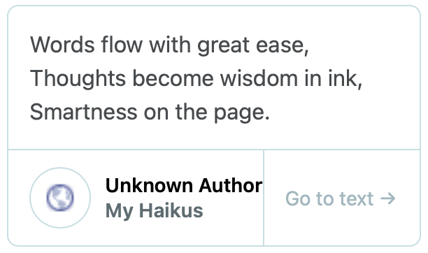

# rehype-quotebacks

`rehype-quotebacks` is a plugin for [rehype](https://github.com/rehypejs/rehype) that transforms Markdown blockquotes into [quoteback embeds](https://quotebacks.net/).

It effectively turns this markdown from the quoteback extensions into an embed.

```markdown
> Words flow with great ease,  
> Thoughts become wisdom in ink,  
> Smartness on the page.

Source: [My Haikus](https://example.org/haikus) by Unknown Author
```

into this

```html
<blockquote class="quoteback" data-title="My Haikus" data-author="Unknown Author" cite="https://example.org/haikus">
    <p>Words flow with great ease,<br>
    Thoughts become wisdom in ink,<br>
    Smartness on the page.</p>
    <footer>Unknown Author<cite> <a href="https://example.org/haikus">My Haikus</a></cite></footer>
</blockquote>
<script note="" src="https://cdn.jsdelivr.net/gh/Blogger-Peer-Review/quotebacks@1/quoteback.js"></script>
```

...which renders like this:




## Installation

```bash
npm install rehype-quotebacks
```

## Usage

Consider the following `example.js` with rehype processor (or use unified) setup as follows:

```javascript
import rehypeStringify from 'rehype-stringify'
import remarkParse from 'remark-parse'
import remarkRehype from 'remark-rehype'
import {unified} from 'unified'
import rehypeQuotebacks from './src/index.js'

const processor = await unified()
  .use(remarkParse) // parses markdown
  .use(remarkRehype) // converts markdown to html
  .use(rehypeQuotebacks) // converts html to html with quotebacks
  .use(rehypeStringify) // converts html to string

const markdown = `
> My quote

Source: [My Blog](https://example.org/blog) by Anonymous Author
`

const result = processor.processSync(markdown)

console.log(String(result))
```

Now, running node example.js yields:

```html
<blockquote class="quoteback" data-title="My Blog" data-author="Anonymous Author" cite="https://example.org/blog">
<p>My quote</p>
<footer>Anonymous Author<cite> <a href="https://example.org/blog">My Blog</a></cite></footer>
</blockquote>
<script note="" src="https://cdn.jsdelivr.net/gh/Blogger-Peer-Review/quotebacks@1/quoteback.js"></script>
```

## Contributing

Pull requests are welcome. For major changes, please open an issue first to discuss what you would like to change.

Please make sure to update tests as appropriate.

## License

[MIT](https://choosealicense.com/licenses/mit/)
